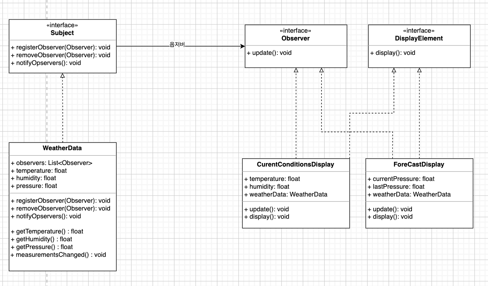

## 옵저버 패턴

> 한 객체의 상태가 바뀌면 그 객체에 의존하는 다른 객체에게 연락이 가고 자동으로 내용이 갱신되는 방싱그로 일대다(one-to-many) 의존성을 정의합니다. 

- 주제는 동일한 인터페이스를 써서 옵저버에게 연락합니다.
- Observer 인터페이스를 구현하기만 하면 어떤 옵저버라도 패턴에 참여할 수 있습니다.
- 주제는 옵저버들이 Observer 인터페이스를 구현한다는 것을 제외하면 옵저버에 관해 전혀 모릅니다. 따라서 이들 사이의 결한은 느슨한 결합입니다.
- 주제가 데이터를 보내거나(push), 옵저버가 데이터를 가져올 수 있습니다(pull). 일반적으로는 pull 방식이 더 옳은 방식이라고 간주합니다.

