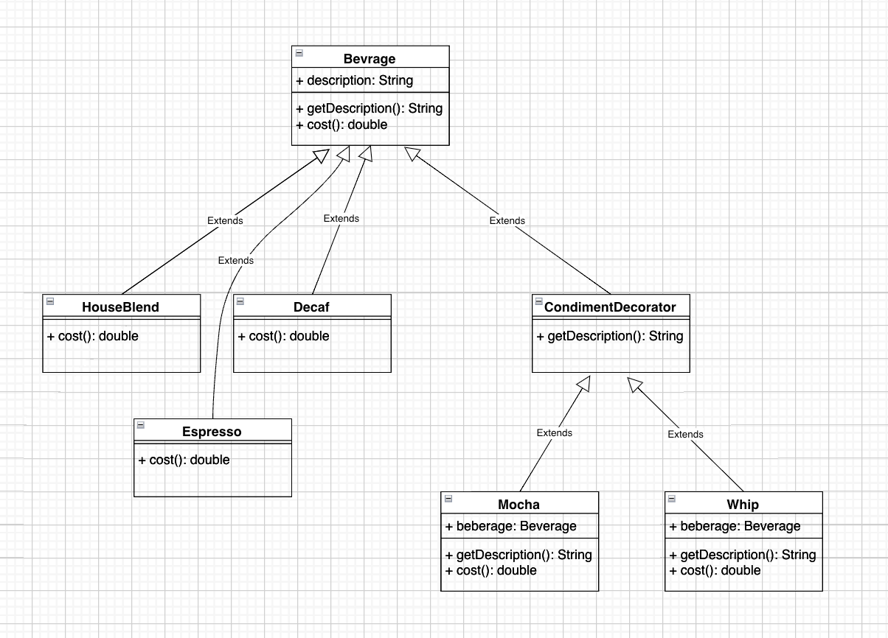

## 데코레이터 패턴

> 객체에 추가 요소를 동적으로 더할 수 있습니다. 데코레이터를 사용하면 서브클래스를 만들 때보다 훨씬 유연하게 기능을 확장할 수 있습니다.

- 상속 대신 데코레이너 패턴으로 행동을 확장할 수 있습니다.
- 데코레이터 패턴은 구상 구성 요소(Decaf, HouseBlend, Espresso)를 감싸주는 데코레이터(Mocha, Whip)를 사용합니다.
- 데코레이터 패턴을 사용하면 자잘한 객체가 매우 많이 추가될 수 있고, 데코레이터를 너무 많이 사용하면 코드가 필요이상으로 복잡해집니다.

