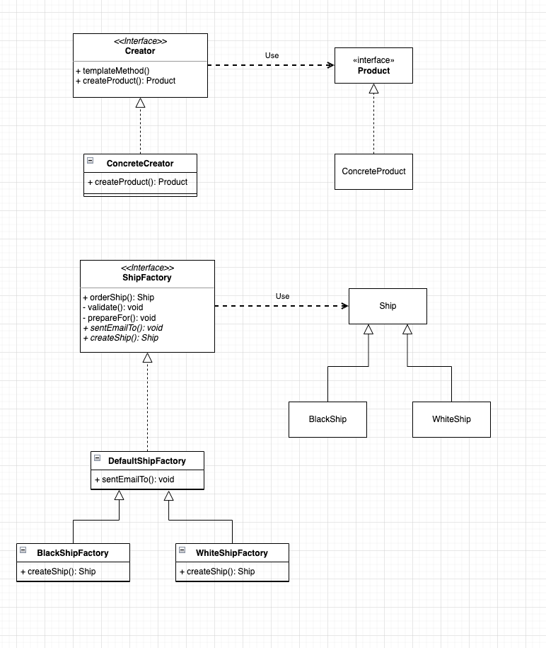

## 팩토리 메서드 패턴

> Factory method는 부모(상위) 클래스에 알려지지 않은 구체 클래스를 생성하는 패턴이며. 자식(하위) 클래스가 어떤 객체를 생성할지를 결정하도록 하는 패턴 - 위키백과

### 팩토리 메서드 패턴의 장점
- 확장에는 열려있고 변경에 닫혀있는 객체 지향의 원칙을 준수할 수 있다.
- 기존의 객체 생성 로직을 수정하지 않고 새로운 형태의 객체를 생성방법을 추가할 수 있다.

### 팩토리 메서드 패턴의 단점
- 책임과 역할이 많아지다보니 클래스가 많아진다.

### 예제 다이어그램

### 주의할 점
- 인터페이스의 default 자바8에 추가된 문법으로 해당 인터페이스를 구현한 클래스, 해당 인터페이스를 구현한 클래스를 확장(상속)한 클래스 또한 인터페이스의 디폴트 메서드를 사용할 수 있다. 해당 기능으로 자바 8이후로는 추상클래스를 그렇게 많이 사용하지 않는다고 한다. 